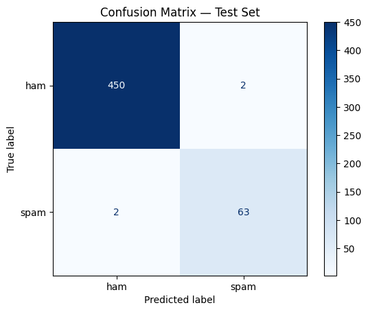

# BERT Spam Classifier

Fine-tuning BERT (`bert-base-uncased`) untuk klasifikasi pesan **spam vs ham**.

> ⚠️ **Status: notebook siap dijalankan, belum di-run end-to-end.** Metrik final di bawah masih placeholder
> dan akan diisi angka asli setelah dijalankan di Google Colab. Lihat catatan di `notebook/bert_spam_classifier.ipynb`.

## Alur

```
Data berlabel → Tokenizer BERT → Fine-tuning → Evaluasi → Deploy/Predict
```

## Dataset

[SMS Spam Collection v.1](https://raw.githubusercontent.com/justmarkham/pycon-2016-tutorial/master/data/sms.tsv)
(Almeida et al., 2011). Rilis resmi berisi 5.574 pesan SMS berbahasa Inggris berlabel ham/spam; mirror
GitHub yang dipakai di sini berisi 5.572 baris (selisih 2 baris dari rilis resmi, kemungkinan perbedaan
parsing pada mirror).

Statistik terverifikasi:

| | Jumlah |
|---|---|
| Total baris (mirror yang dipakai) | 5.572 |
| Setelah hapus duplikat | 5.169 |
| Ham | 4.516 (87,4%) |
| Spam | 653 (12,6%) |

Split stratified (`random_state=42`), tersedia di `data/`:

| Split | Total | Ham | Spam |
|---|---|---|---|
| Train | 4.135 | 3.612 | 523 |
| Validation | 517 | 452 | 65 |
| Test | 517 | 452 | 65 |

## Model & Hyperparameter

- Base model: `bert-base-uncased`
- `max_length=128`, `learning_rate=2e-5`, `batch_size=16`, `epochs=3`

## Hasil

Tiga pendekatan dibandingkan di test set yang sama (517 pesan; lihat notebook Bagian 5 & 6):

| Model | Accuracy | Precision (spam) | Recall (spam) | F1 (spam) |
|---|---|---|---|---|
| Naive Bayes (baseline) | 0,9845 | 0,9524 | 0,9231 | 0,9375 |
| BERT frozen + head custom | 0,9845 | 0,8904 | 1,0000 | 0,9420 |
| BERT full fine-tuning | 0,9923 | 0,9692 | 0,9692 | 0,9692 |

Fine-tuning penuh unggul di semua metrik pada split ini. Frozen-BERT punya recall sempurna (tidak ada
spam yang lolos) tapi precision paling rendah (lebih banyak ham yang salah ditandai spam) — trade-off
berbeda, bukan sekadar kalah di semua sisi.



Confusion matrix (BERT full fine-tuning, test set 517 pesan): 450 ham benar, 2 ham salah ke spam,
2 spam salah ke ham, 63 spam benar.

### Catatan Desain: Fine-tuning Penuh vs Feature Extraction

Notebook referensi yang ditemukan saat eksplorasi materi bootcamp sebenarnya membekukan seluruh
parameter BERT dan hanya melatih head klasifikasi custom (feature extraction), berbeda dari fine-tuning
penuh yang diimplementasikan sebagai pendekatan utama di repo ini. Kedua pendekatan disertakan di
notebook untuk perbandingan langsung, dievaluasi pada split data yang identik.

## Contoh Inferensi

Hasil aktual dari 4 teks uji:

| Teks | Prediksi | p_spam |
|---|---|---|
| "Congratulations! You've won a free iPhone, click the link to claim now." | SPAM | 0,9988 |
| "Hey, what time is the meeting tomorrow?" | HAM | 0,0008 |
| "URGENT loan approved in 5 minutes, WhatsApp us now!" | HAM (meleset) | 0,0006 |
| "Can you send me the revised file, please?" | HAM | 0,0058 |

Baris ketiga meleset. Dataset training berasal dari sekitar 2011, sebelum "WhatsApp" umum dipakai dalam
teks spam berbahasa Inggris, sehingga frasa itu kemungkinan di luar distribusi data training.

## Struktur Repo

```
.
├── data/               # train/val/test split (CSV)
├── notebook/           # notebook fine-tuning (Google Colab)
├── src/                # (opsional) script inferensi standalone
├── images/             # confusion matrix, plot, dsb.
├── requirements.txt
└── README.md
```

## Cara Menjalankan

1. Buka `notebook/bert_spam_classifier.ipynb` di Google Colab (aktifkan GPU runtime).
2. Jalankan seluruh cell dari atas ke bawah.
3. Catat metrik evaluasi di cell "Evaluasi di Test Set", lalu perbarui tabel Hasil di README ini.

## Referensi

- Almeida, T. A., Gómez Hidalgo, J. M., & Yamakami, A. (2011). *Contributions to the Study of SMS Spam Filtering: New Collection and Results.* ACM DocEng.
- Devlin, J., Chang, M. W., Lee, K., & Toutanova, K. (2018). *BERT: Pre-training of Deep Bidirectional Transformers for Language Understanding.*
